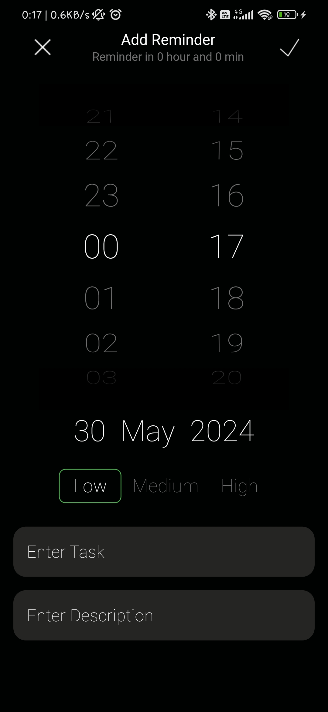

# Reminder - Minimalistic Flutter App

## [DEMO](https://drive.google.com/file/d/1KsiA5UG7m_6qO10xp8a4LcpSyBoNcDEf/view?usp=drive_link)

## Screenshots

   

   

 

 

## Features

- Save reminders locally
- Receive local push notifications
- Track usage analytics with Firebase
- Create, read, update, and delete reminders
- Sort reminders by time and priority

## Dependencies

- Bloc
- Hive (for local storage)
- GetIt (for dependency injection)
- Flutter Local Notifications
- Firebase Analytics
